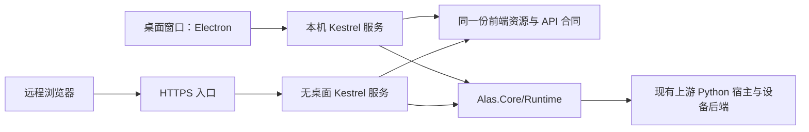

# R4 统一 UI 技术调研与实施方向

> 历史归档：保留调查过程和旧快照，不代表当前实现或待办。当前说明见[核心文档](../../README.md)。

调研日期：2026-09-24。目标是尽量用一套界面代码覆盖桌面窗口、远程浏览器和无桌面服务器，兼顾 Windows、Linux、macOS 与 x64、ARM64；最终布局与主题以第三方上游 AzurPilot 为参照。

## 推荐组合

**React + TypeScript + Vite 前端，ASP.NET Core 10 / Kestrel 服务，Electron 桌面壳。** 前端只构建一份静态资源；桌面与网页消费相同 API。桌面壳负责窗口、托盘、服务进程和退出生命周期，不承载任务规则。

这里的桌面版是拥有系统窗口、菜单和托盘的应用，窗口内采用 Web 渲染。它可以最大程度复用网页代码；如果要求每个按钮都使用操作系统原生控件，就需要另一套渲染层，难以同时保持与上游网页相同的外观。

| 层 | 技术与职责 |
| --- | --- |
| 唯一前端 | React、TypeScript、Vite、React Router；CSS 变量统一主题、间距和布局，Lucide 图标与上游保持相近风格 |
| 服务入口 | ASP.NET Core 10 / Kestrel 同源托管静态资源与 API；API 调用 `Alas.Core/Runtime`，不复制调度和结果判断 |
| 通信 | 初期采用 HTTP 查询/命令与 SSE 状态、日志推送；事件需有游标、重连和慢客户端处理。具体合同在服务迁移时冻结 |
| 桌面壳 | 维护中的 Electron 版本；本机模式启动 .NET 服务并加载回环地址，也可仅作为远程服务客户端 |
| 无桌面部署 | .NET 服务与所需 Python/设备依赖；发布产物包含前端构建文件，运行时无需 Node.js、Electron 或桌面显示服务 |
| 静态报告 | 保留 `tools/report_html.py` 的单文件归档能力，与交互前端共享运行事实和结果合同 |

## 两份上游的实际结构

AzurPilot 的 `frontend/README.md`、`frontend/package.json` 和 `frontend/src/app/App.tsx` 明确采用 React、TypeScript、Vite 与 React Router；`module/api/app.py` 通过 Starlette 提供静态页面和 `/api/v1/ws`。其前端本身不依赖 Electron，桌面启动器属于独立项目。调研依据为本地上游提交 `f67259dcd`，未把启动器 README 的平台宣传当作本项目实测。

原 ALAS 的 `module/webui/app.py` 使用 PyWebIO，`gui.py` 由 Uvicorn 托管；旧 `webapp` 是 Electron 15 / Vue 3 的窗口壳，通过 iframe 加载本机 Python WebUI。其旧 Electron 版本与窗口安全配置不作为新实现基线。

AzurPilot 与本项目均使用 GPL-3.0；如复用组件或样式代码，需保留许可和来源。品牌标识、游戏图片、外部壁纸单独核对授权，不将开发设备截图或账号信息用作产品素材。

## 三种运行模式

- 桌面本机模式由启动器管理服务进程，使用回环地址和本次会话入口；关闭窗口与停止运行分别处理，不能直接杀掉正在执行的出击。
- 远程网页访问服务器提供的同一前端，任务、Python 宿主和设备连接均在服务器端运行；浏览器架构不决定设备后端架构。
- 纯服务器模式独立启动 Kestrel，前端预构建文件随服务发布。服务器发行包不捆绑桌面壳；桌面发行包按目标系统和架构组合所需组件。

## 选型取舍

| 方案 | 对本项目的适配程度 | 主要代价 |
| --- | --- | --- |
| React SPA + Electron | 首选。接近 AzurPilot 组件与 CSS 体系；统一 Chromium 有利于桌面跨系统呈现一致；网页直接复用 | 安装包与内存较大，需要跟随 Electron 安全更新 |
| 同一 SPA + Tauri 2 | 可作为后续桌面包体优化，不影响前端或服务合同 | 引入 Rust 构建链；Windows 依赖 WebView2、Linux 依赖 WebKitGTK，系统 WebView 差异需重新验收；sidecar 按目标三元组打包 |
| Blazor Web / Hybrid | 能共享 Razor 组件，适合优先统一 C# 的项目 | 迁移 AzurPilot React 展示层收益小；MAUI 官方桌面平台不包含 Linux，仍需额外桌面承载方案 |
| Avalonia 等独立桌面控件体系 | 适合原生桌面体验优先的产品 | 与现有 React/CSS 展示层差异较大；浏览器目标需要单独评估，当前不增加第二套 UI |

目前没有测量 Electron 与 Tauri 的本项目包体或内存，不能据框架宣传给出本项目性能数字。先完成同一前端与服务，再以实际发行包决定是否值得换壳。

## 平台与架构承诺边界

Electron 官方提供 Windows、Linux、macOS 的 x64 与 ARM64 预构建产物；.NET 有相应的 `win-*`、`linux-*`、`osx-*` RID。它们证明技术栈有这些目标，不证明本项目整包已经支持六种组合。

| 交付层 | 必须验证的内容 |
| --- | --- |
| 网页 | Chromium、Firefox、WebKit 的页面与交互；桌面与窄屏、明暗主题、键盘操作、连接中断恢复 |
| 桌面 | 每个目标的安装、签名策略、窗口/托盘、服务启动退出、路径与文件权限、离线打开 |
| .NET 服务 | Windows/Linux x64/ARM64 的发布和无显示服务启动；macOS 先覆盖桌面本机服务 |
| 自动化宿主 | 各目标的 Python、图像/OCR 原生依赖、ADB 及可用设备后端；逐目标建包和实测 |

先在现有 Windows x64 环境验证完整链，再建立 Linux x64/ARM64 的服务器验证；其余桌面目标进入独立构建与验收矩阵。未通过相应门槛前标记为未验证，不因网页可打开就宣称自动化可运行。构建依赖与缓存放在项目忽略目录，生产页面不依赖 CDN 或在线构建。

## 视觉和数据映射

沿用 AzurPilot 的顶栏、窄工具栏、实例/任务导航、总览工作区、队列卡片及日志区域；匹配其圆角、字体层级、间距、浅色/深色主题与移动端抽屉。先建立主题变量和公共组件，避免逐页复制样式。

任务分组、表单标签和字段说明消费上游导出的配置元数据；配置校验、任务许可、调度、停止和结论仍由本项目运行时负责。页面对 `TaskOutcome` 和 `sortie-result/1` 做展示，不从日志、百分比或退出状态另判成功。这里的产品 UI 建设不改变游戏内页面操作；游戏导航与点击继续走上游原生流程。

## 远程入口与当前原型

当前 `alashub control` 使用 `HttpListener`，只绑定 `127.0.0.1`，状态接口为本机页面提供会话令牌。它是本地接口原型，尚不是本方案的服务器交付。不能仅修改绑定地址就对外开放。

Kestrel 远程模式需具备认证会话、读取与操作权限、HTTPS、来源/CSRF 校验及受信任代理配置；任务动作授权继续由运行时检查。桌面渲染器关闭 Node integration，开启 context isolation 和 sandbox，限制导航与外链。原始日志、截图和配置的读取也受同一授权约束，不能把整个工件根目录作为匿名静态站点提供。

## 迁移顺序与验收

1. 固定运行请求、状态、报告、日志与停止的 API 合同；把原型传输层迁入 Kestrel，业务编排继续留在 `Alas.Core/Runtime`。保留当前真实 HTTP dry-run 和停止回归。
2. 建立 React 前端与模拟服务，先完成 AzurPilot 风格的公共布局、总览、任务配置和报告；同一构建产物在桌面窗口与普通浏览器使用。
3. 补齐远程会话与权限测试，再允许非回环监听；验证断线重连、重复请求、慢客户端、多窗口操作及长任务不中断。
4. 接入 Electron 生命周期与平台打包，验证桌面、远程浏览器和无桌面服务器均执行相同 dry-run 队列并展示相同结论，再逐目标验证设备能力。

当前已经完成的是技术调研和本地控制原型验收。React 产品前端、Kestrel 远程服务、Electron 发行包和跨平台自动化尚未交付；R4/R5 门槛不会因选型文档完成而自动达成。

## 依据

- [AzurPilot 前端说明](https://github.com/wess09/AzurPilot/blob/master/frontend/README.md)、[布局组件](https://github.com/wess09/AzurPilot/blob/master/frontend/src/app/App.tsx)、[服务入口](https://github.com/wess09/AzurPilot/blob/master/module/api/app.py)
- [原 ALAS Web 应用](https://github.com/LmeSzinc/AzurLaneAutoScript/tree/master/webapp)
- [Electron 平台支持](https://github.com/electron/electron#platform-support)、[安全建议](https://www.electronjs.org/docs/latest/tutorial/security)
- [Tauri 前提条件](https://v2.tauri.app/start/prerequisites/)、[构建矩阵](https://v2.tauri.app/distribute/pipelines/github/)、[sidecar](https://v2.tauri.app/develop/sidecar/)
- [.NET RID](https://learn.microsoft.com/en-us/dotnet/core/rid-catalog)、[发布方式](https://learn.microsoft.com/en-us/dotnet/core/deploying/)、[Kestrel](https://learn.microsoft.com/en-us/aspnet/core/fundamentals/servers/kestrel?view=aspnetcore-10.0)
- [MAUI 平台范围](https://learn.microsoft.com/en-us/dotnet/maui/supported-platforms?view=net-maui-10.0)、[Blazor Hybrid](https://learn.microsoft.com/en-us/aspnet/core/blazor/hybrid/?view=aspnetcore-10.0)
