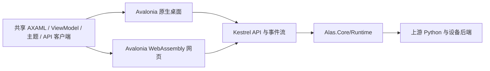

# 统一 UI 技术方案

目标：尽量共享 C# 界面代码，覆盖原生桌面、远程网页和纯服务器模式，外观接近 AzurPilot。
**桌面不能使用浏览器壳或 WebView 承载主要 UI。首选候选为 Avalonia，备选为 Uno Skia；服务使用 ASP.NET Core 10 / Kestrel。**
已接通共享界面和桌面/WASM 构建入口，原 React/Electron 方向已撤销。当前使用模拟数据，尚未连接服务或设备。

## 方案比较

| 方案 | 桌面与网页共用方式 | 结论 |
| --- | --- | --- |
| Avalonia | C#/AXAML、ViewModel、主题共享；桌面原生窗口 + Skia，网页 WebAssembly + CanvasKit/WebGL | 首选：本项目没有 WinUI 存量界面，适合自定义上游风格；网页首载、输入与无障碍须实测 |
| Uno Platform + Skia | C#/WinUI XAML 共享；Skia Desktop 与 WebAssembly 使用统一绘制 | 可行备选；适合已有 WinUI 资产的项目。若追求一致外观，各端应统一 Skia，不能把 WinAppSDK 原生渲染与它混为同一路径 |
| MAUI / Blazor Hybrid | MAUI 本身没有同一 UI 的浏览器目标；Hybrid 共享 Razor 但桌面使用 WebView | 不满足本轮约束，且 MAUI 官方桌面范围不含 Linux |
| React + Electron / Tauri | 网页直接复用，桌面依赖 Chromium 或系统 WebView | 不满足无浏览器壳要求 |

这里的“原生”指系统窗口与原生图形绘制，不要求每个控件都是 WinUI/AppKit/GTK 控件，也不要求 Native AOT。
系统原生控件会随平台改变外观；统一自绘更符合展示一致和自定义主题的目标。共享源码仍需分别发布桌面与 WASM 产物。

## 代码与运行模式



- `Alas.UI` 保存共享界面、交互、主题和客户端状态；`Alas.Contracts` 保存传输信封，`Alas.Client` 提供 HTTP 客户端，两者不引用设备或 Python 实现。
- `UI.Desktop` 负责窗口、托盘、文件选择及本机服务生命周期；既能连接本机，也能连接远程服务。
- `UI.Browser` 使用同一共享界面；文件、剪贴板、下载和页面地址由浏览器适配层处理，不能直接访问服务器文件系统。
- `Server` 独立发布，只运行 Kestrel、业务运行时和设备依赖，并托管预构建 WASM 静态文件；不启动 Avalonia 桌面、浏览器、显示服务或 Node.js。
- 桌面和网页调用同一 API。队列、授权、停止、日志及结论留在运行时；关闭窗口或浏览器不直接终止正在执行的任务。
- 初期用 HTTP 命令/查询与 SSE 状态推送；定义事件游标、重连、慢客户端及重复请求行为。远程开放前完成认证、HTTPS 与来源检查。

WASM 在访问者浏览器中绘制界面，服务端不按用户渲染桌面画面。这与远程桌面串流或在桌面嵌入 WebView 不同。
浏览器无法加载现有 CPython/ADB，不能把 `Alas.Core` 整体打进 WASM；服务端事实仍按 `TaskOutcome` 和 `sortie-result/1` 展示。

## 还原 AzurPilot 的成本

已核对上游提交 `f67259dcd` 的 `App.tsx`、`styles/tokens.css` 与组件依赖。它是 React/CSS 界面，不能直接转换成 AXAML。

| 范围 | 实施与难度 |
| --- | --- |
| 顶栏、侧栏、任务导航、总览卡片、表单、弹窗 | 中等：建立共享布局和 ControlTheme，按上游主题参数还原，避免每页复制样式 |
| 明暗主题、字体、图标、圆角、间距、窄屏抽屉 | 中等：资源字典与响应式布局；固定可分发字体，核对中英文字形、DPI 和浏览器缩放 |
| 高频日志、大表格、统计图 | 中高：虚拟化与批量更新；ECharts 需用共享绘图/图表组件重做，不能只在网页保留另一套实现 |
| CodeMirror 编辑器、液态玻璃、背景模糊 | 高：需要替代控件或自定义渲染；若要求这些效果也高度一致，须在选型原型中验证，不能默认等价或嵌 WebView 绕过 |

可以以接近上游的布局、主题和交互为验收目标；没有双端截图与实际交互对照前，不承诺像素完全一致、固定复用比例或性能数字。
复用上游设计/素材时保留 GPL-3.0 与对应素材许可；不复制开发设备截图或账号数据。

## 平台边界

Avalonia 官方列出 Windows、macOS、Linux 的 x64/ARM64 目标，但 OS 版本与架构支持等级不同；不能把目标存在当成本项目已支持。
Linux 桌面当前主要走 X11；12.1 起的原生 Wayland 为实验性。普通服务器不依赖这些显示后端，优先验证 glibc 发行版。
网页目标要求 WASM/WebGL；首载包含 .NET 与绘图库，需测冷/热启动、内存与日志刷新。官方浏览器无障碍仍标为部分支持。
中文输入法、复制选择、上传下载、键盘焦点、触控和断线恢复必须逐浏览器验证；AOT 会增加构建与下载成本，按实测决定。

**当前自动化服务仍有 Windows 假设**：`PythonHost` 使用 `kernel32`、`python3*.dll`、Windows venv 布局及路径分隔符。
Linux/macOS 需补对应 libpython 和依赖布局；x64/ARM64 还需匹配 Python、OpenCV、ONNX Runtime、PyAV 及设备后端。
服务器以实际可用的 ADB 设备连接为准，不能承诺 Windows 专属模拟器管理能力。UI 选型不改变宿主替换门槛，也不引入 Python.NET。

## 实施门槛

1. 先做共享 Avalonia 原型：上游风格的导航、总览、配置、日志及代表性复杂效果，同时发布 Windows x64 桌面和 WASM。
2. 用相同数据、主题、尺寸及字体对照两端，验证中文输入、滚动、图表/编辑器、缩放和首载；有不可接受缺口时再以同一场景比较 Uno Skia。
3. 固定服务合同并迁入 Kestrel，保留真实 HTTP dry-run、零设备调用、边界停止及退出落盘验证；客户端不新增业务状态机。
4. 验证 Windows x64 与 Linux x64/ARM64 无显示环境服务，再逐项验收 macOS 与其余桌面架构。UI、服务、自动化宿主分别记录通过范围。
5. SDK、WASM 工具链与 NuGet 缓存放项目忽略目录；发行包验证脱离源码目录、普通权限和离线启动，生产资源不依赖 CDN。

## 原型与无窗口验证

`Alas.UI.slnx` 独立于 CLI 方案，使用 Avalonia 12.1.3、.NET 10。
`Alas.UI` 的同一 AXAML/样式/ViewModel 供 Desktop 与 Browser 引用，已实现导航、总览、明暗主题、JSON 文本编辑和虚拟化日志。
图表为共享绘制的固定演示序列；JSON 检查只检查顶层结构，不代表服务端校验或任务运行。中文字体内置 Noto CJK 2.004（OFL），来源见字体目录。

Windows + PowerShell 7 的构建入口（不会启动桌面或浏览器窗口）：

```powershell
./tools/build_ui.ps1 -Bootstrap -Publish  # 首次联网准备项目内 SDK、WASM 工作负载及包源
./tools/build_ui.ps1 -Publish             # 后续仅使用项目内工具链与离线包源
```

SDK 固定为 10.0.401，依赖保存在 `.runtime/dotnet`、`.runtime/nuget`，不要求全局安装。
省略 `-Publish` 仍构建两端并运行 Headless；加上后生成 `.runtime/ui-publish/desktop-win-x64` 与 `browser/wwwroot`。
离线构建不查询在线漏洞公告；依赖安全公告需另行联网审计。UI 编译路径映射为中性路径，Release 关闭托管/原生调试符号。
发布后自动执行 `verify_ui_artifacts.ps1`，检查 DLL、WASM、JS 及解压后的资源是否包含个人路径，并检查网页入口引用是否齐全。

`Alas.UI.Headless` 使用 Avalonia 原生 Headless 窗口后端和 Skia 离屏渲染：鼠标点击、中文文本注入与双向绑定、JSON 错误反馈、主题往返、宽窄布局和 2,000 行日志滚动均已通过，进程正常退出。
日志场景只实例化 6 个可见行控件；这证明虚拟化生效，不是性能基准。离屏 PNG 留在 `.runtime/ui-headless`，测试有 90 秒退出上限。
自动化不得打开真实桌面或浏览器窗口；`Window.Show()` 在该测试中只连接内存窗口实现，不连接系统桌面。

尚未验收：真实浏览器/系统输入法、DPI、无障碍、首载与内存、复杂编辑器/玻璃效果、双端现场视觉一致性。
本地控制 API 已迁入 `Alas.Server` 的 Kestrel；既可由 `alashub control` 启动，也可由独立 `Alas.Server`
进程启动。独立入口可用 `--ui-root` 同源托管预构建 WASM，仍只监听回环并沿用 Host/Origin/令牌校验；
静态托管不提供远程认证或 HTTPS。编排收口至 `Alas.Core/Runtime/ControlWorkspace`，合同见[运行时](runtime.md)。
共享 HTTP 客户端及 SSE 完整状态快照流已通过真实服务离线回归，尚未接入 UI；快照有游标、重连基准和慢订阅合并，不承诺审计事件重放。
独立服务入口和选定 UI 根目录的 HTTP/MIME/路径隔离已有无窗口回归；WASM 实际浏览器加载、远程认证、HTTPS、独立服务完整发行及其他平台/架构仍待实现或验证。Headless 结果不能替代这些结论。状态统一见[路线](architecture-roadmap.md)。

## 依据

2026-09-24 查阅 Avalonia 12.1.3 与 Uno 6.6.166 发布资料；Uno 使用稳定标签文档，避免把 master 的 7.0 行为当成已发布能力。

- Avalonia：[渲染方式](https://docs.avaloniaui.net/docs/welcome)、[支持矩阵](https://docs.avaloniaui.net/docs/supported-platforms)、[WASM 发布](https://docs.avaloniaui.net/docs/deployment/webassembly)、[无障碍边界](https://docs.avaloniaui.net/docs/app-development/accessibility)。
- Uno 6.6：[Skia 渲染](https://github.com/unoplatform/uno/blob/6.6.166/doc/articles/features/using-skia-rendering.md)、[桌面](https://github.com/unoplatform/uno/blob/6.6.166/doc/articles/features/using-skia-desktop.md)、[WASM 发布](https://github.com/unoplatform/uno/blob/6.6.166/doc/articles/uno-publishing-webassembly.md)。
- 上游：[布局](https://github.com/wess09/AzurPilot/blob/f67259dcd/frontend/src/app/App.tsx)、[主题参数](https://github.com/wess09/AzurPilot/blob/f67259dcd/frontend/src/styles/tokens.css)、[组件依赖](https://github.com/wess09/AzurPilot/blob/f67259dcd/frontend/package.json)。
- [MAUI 平台范围](https://learn.microsoft.com/en-us/dotnet/maui/supported-platforms?view=net-maui-10.0)、[Blazor Hybrid](https://learn.microsoft.com/en-us/aspnet/core/blazor/hybrid/?view=aspnetcore-10.0)；旧浏览器壳调研仅留在[历史归档](archive/history/r4-ui-architecture-20260924.md)。
